<picture><source media="(max-width: 600px)" srcset="https://github.com/danielsouzaa7/danielsouzaa7/raw/main/assets/profile/hero-mobile.svg"></picture>

**Dados & Business Intelligence · Analytics · Marketplace · IA aplicada · Engenharia de software e produto.**

Começo pela decisão que o negócio precisa tomar — e só depois escolho entre dados, software ou IA para sustentá-la.

## Sobre

<picture><source media="(max-width: 600px)" srcset="https://github.com/danielsouzaa7/danielsouzaa7/raw/main/assets/profile/about-mobile.svg"></picture>

Venho da operação — marketplace, CRM e indicadores. Isso moldou a forma como construo: primeiro entendo a decisão que o negócio precisa tomar; depois desenho os dados e o sistema que sustentam essa decisão.

Não trabalho a partir da ferramenta. Trabalho a partir do problema, e a ferramenta vem depois: SQL e Power BI quando a resposta é um indicador, Python quando é um modelo de dados, software quando a decisão precisa virar operação todo dia.

## Da operação para a engenharia

<picture><source media="(max-width: 600px)" srcset="https://github.com/danielsouzaa7/danielsouzaa7/raw/main/assets/profile/marketplace-mobile.svg"></picture>

Estruturei e conduzi a operação de marketplace de uma concessionária Honda — anúncios, pós-venda, indicadores, prevenção de fraude — da implantação até **R$ 1,1 milhão+ em vendas e mais de 5 mil pedidos**.

Foi ali que a pergunta deixou de ser *"quanto vendemos?"* e passou a ser *"por que vendemos isso, e o que fazer na semana que vem?"*. Os dois projetos abaixo nasceram dessa pergunta.

## Projetos em destaque

<a href="https://github.com/danielsouzaa7/pulse-marketplace-decision-intelligence"><picture><source media="(max-width: 600px)" srcset="https://github.com/danielsouzaa7/danielsouzaa7/raw/main/assets/projects/pulse-mobile.svg"></picture></a>

### Pulse — Marketplace Decision Intelligence

Transforma os sinais dispersos de um marketplace em uma lista curta de decisões priorizadas, cada uma com a evidência que a sustenta.

- **Problema:** na média da empresa, a zona que está falhando desaparece; olhando métrica por métrica, são sinais demais para agir.
- **Diferencial:** o motor decide, o modelo explica. Métricas, anomalias, impacto e a ordem das prioridades saem de funções determinísticas; o modelo de linguagem recebe só a evidência já calculada, e um validador confere cada número da resposta contra ela.
- **Prova:** 656 testes (655 passam; 1 pulado, documentado), sobre dados 100% sintéticos.
- **Stack:** Python · DuckDB · SQL · pandas · Streamlit · Anthropic SDK
- **Status:** em construção incremental, sem implantação em produção.

**[Abrir o repositório](https://github.com/danielsouzaa7/pulse-marketplace-decision-intelligence)**

<a href="https://github.com/danielsouzaa7/event-operations-os-showcase"><picture><source media="(max-width: 600px)" srcset="https://github.com/danielsouzaa7/danielsouzaa7/raw/main/assets/projects/event-operations-mobile.svg"></picture></a>

### Event Operations OS

Sistema para casas de eventos pagos: convidados, RSVP, Pix, check-in na porta, mesas e fechamento financeiro versionado.

- **Problema:** WhatsApp, planilha, lista e extrato divergem — e "confirmou" vira "pagou" sem ninguém ter visto o dinheiro.
- **Diferencial:** regras críticas dentro do PostgreSQL — idempotência, locks de linha e fechamento imutável, que ganha uma nova versão quando chega um Pix atrasado.
- **Prova:** 1.137 testes unitários; integração e aceitação contra PostgreSQL e PostgREST reais.
- **Stack:** Next.js · React · TypeScript · PostgreSQL
- **Status:** software comercial — código privado, apresentação pública.

**[Abrir o showcase](https://github.com/danielsouzaa7/event-operations-os-showcase)**

Também no GitHub: [VeloFin](https://github.com/danielsouzaa7/velofin-fintech), MVP acadêmico de gestão financeira em HTML e Tailwind CSS. Projetos de clientes ficam em repositórios privados.

## Como eu construo

<picture><source media="(max-width: 600px)" srcset="https://github.com/danielsouzaa7/danielsouzaa7/raw/main/assets/profile/workflow-mobile.svg"></picture>

Não começo pela tecnologia. Começo pelo problema — e pelos fatos que não podem se confundir.

1. **Problema** — qual decisão o negócio precisa tomar, e com que frequência.
2. **Operação** — como isso acontece na vida real, inclusive quando dá errado.
3. **Dados** — o que existe, o que falta e o que não é confiável.
4. **Regras** — quais fatos são distintos e quais invariantes nunca podem quebrar.
5. **Arquitetura** — onde cada regra precisa morar para continuar verdadeira sob concorrência e falha.
6. **Implementação** — o mínimo que sustenta as regras.
7. **Validação** — testes contra dependências reais quando o risco está nelas.
8. **Produto** — telas que mostram a diferença entre os estados, em vez de escondê-la.

Quando o problema pede análise, os dados abrem um ramo de **BI e Analytics**; quando pede automação, um ramo de **IA aplicada**. Os dois voltam para a validação antes de virar produto — inclusive a IA, que explica e sugere, mas não decide sozinha.

## Stack

<picture><source media="(max-width: 600px)" srcset="https://github.com/danielsouzaa7/danielsouzaa7/raw/main/assets/profile/stack-system-mobile.svg"></picture>

**Dados & BI** — SQL · Power BI · Python · pandas · DuckDB

**Engenharia** — TypeScript · React · Next.js · PostgreSQL · Supabase

**IA aplicada** — LLMs · Anthropic SDK · workflows · validação de saída contra dados estruturados

A ferramenta é consequência do problema, não o contrário.

## Engenharia que eu consigo provar

<picture><source media="(max-width: 600px)" srcset="https://github.com/danielsouzaa7/danielsouzaa7/raw/main/assets/profile/evidence-mobile.svg"></picture>

Números de suítes que rodam, cada um do seu projeto — sem somar um no outro. As suítes de integração e aceitação do Event Operations OS rodam contra PostgreSQL e PostgREST reais, em laboratório local descartável.

## Contato

Quer conversar sobre dados, analytics, IA aplicada ou software? Me chame no **[LinkedIn](https://www.linkedin.com/in/danielsouzavalerio)** — ou comece pelos projetos acima.

---

<picture>
  <source media="(prefers-color-scheme: dark)" srcset="https://raw.githubusercontent.com/danielsouzaa7/danielsouzaa7/output/snake-dark.svg">
  <source media="(prefers-color-scheme: light)" srcset="https://raw.githubusercontent.com/danielsouzaa7/danielsouzaa7/output/snake-light.svg">
  
</picture>
